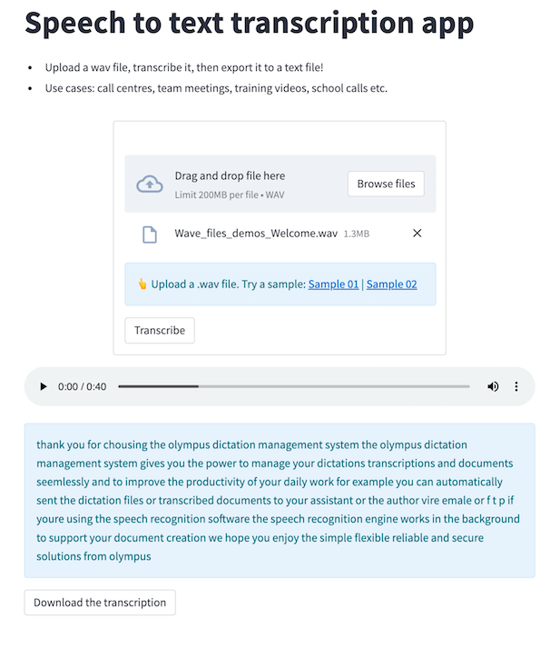

# Speech-to-text Transcription app

 - Just upload a wav file, transcribe it, and download the
   transcription! 🙌
 - **Use cases**: call centres, team meetings, training videos, school
   calls etc...
 - Model-wise, it's using the [Wav2Vec](https://huggingface.co/docs/transformers/model_doc/wav2vec2) model via [HuggingFace's API inference](https://huggingface.co/docs/api-inference/index).

### Questions? Comments?

Please ask in the [Streamlit community](https://discuss.streamlit.io).
